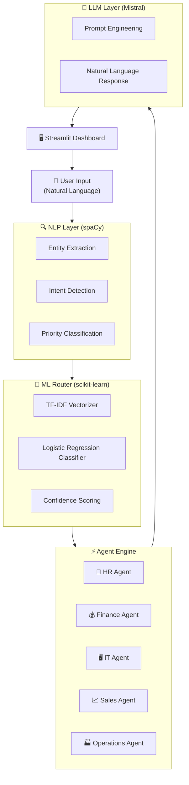
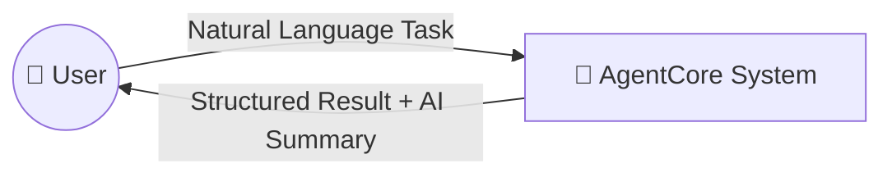
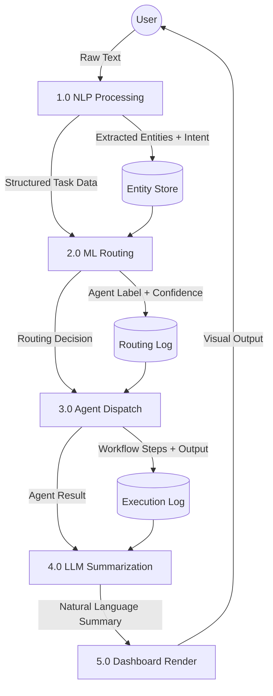
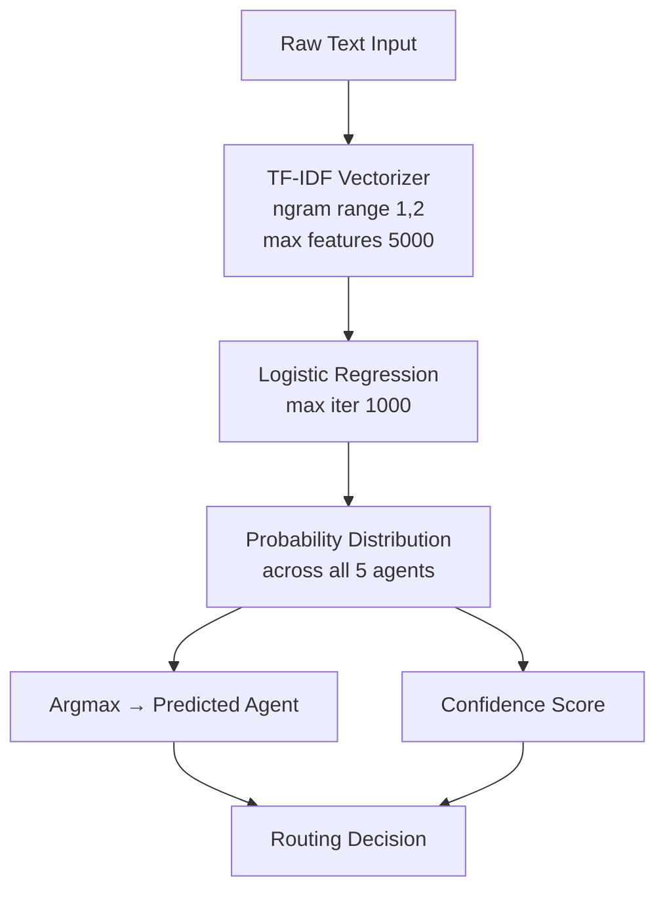
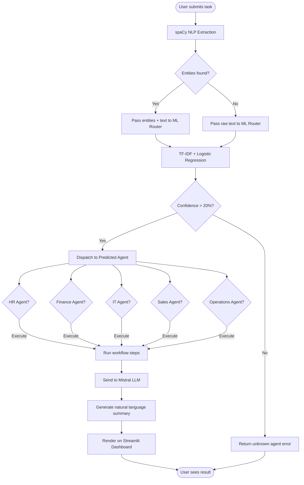
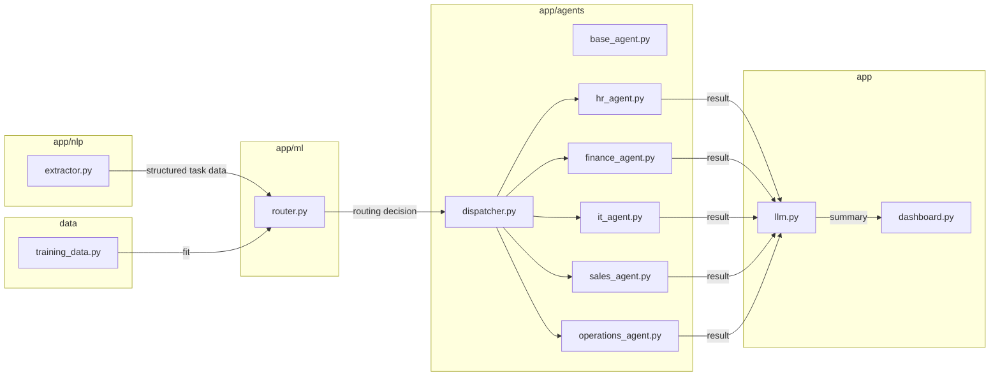

# 🧠 AgentCore — Intelligent Agent Orchestration Engine

> Built as a portfolio project inspired by enterprise AI agent platforms.
> AgentCore demonstrates how natural language input can be intelligently parsed, classified, routed to specialized agents, and summarized using a local LLM — all without a single paid API.


-8A2BE2)


---

## 📌 What is AgentCore?

AgentCore is a **mini intelligent agent orchestration engine** — a simplified version of the core intelligence layer behind enterprise AI platforms like those built by modern agent-marketplace companies.

You type a natural language request. AgentCore:
1. **Understands** it using NLP
2. **Classifies** it using a trained ML model
3. **Routes** it to the correct specialized agent
4. **Executes** a multi-step workflow
5. **Summarizes** the result using a local LLM

All running **100% locally**. No paid APIs. No cloud dependency.

---

## 🎯 Why I Built This

Enterprise AI platforms in 2026 are solving a hard problem:
> *"Given any business request in plain English, how do you automatically decide which agent, tool, or workflow should handle it?"*

That routing + orchestration intelligence is the core ML challenge. This project is my attempt to understand and rebuild that from scratch.

---

## 🏗️ System Architecture



---

## 🔄 Data Flow Diagram (DFD)

### Level 0 — Context Diagram


### Level 1 — System DFD


### Level 2 — ML Router Detail


---

## 🔁 Request Lifecycle Flowchart



---

## 🧩 Component Breakdown



---

## 🛠️ Tech Stack & Reasoning

| Layer | Technology | Why This Specifically |
|---|---|---|
| **NLP** | spaCy `en_core_web_sm` | Industry standard for production NLP. Faster than NLTK, more lightweight than full transformers for entity extraction tasks. Named entity recognition out of the box. |
| **ML Classifier** | scikit-learn `LogisticRegression` | Interpretable, fast to train, works well on small datasets. TF-IDF + LogReg is a proven baseline for text classification — shows ML fundamentals without black-box magic. |
| **Vectorizer** | TF-IDF (ngram 1,2) | Captures both single words and two-word phrases ("duplicate invoice", "new employee") which are critical for intent disambiguation. |
| **LLM** | Mistral 7B via Ollama | Runs 100% locally — no API costs, no data privacy concerns, no rate limits. Mistral 7B punches above its weight for instruction-following tasks. |
| **Backend** | FastAPI | Async, modern, production-grade Python API framework. Used widely in ML serving pipelines. |
| **Frontend** | Streamlit | Purpose-built for ML/data apps. Lets DS/ML engineers build clean UIs without frontend expertise. |
| **Database** | SQLite | Zero-setup embedded database. Perfect for local agent execution logs. No server needed. |
| **Language** | Python 3.13 | Universal language for ML/AI. Entire stack speaks Python natively. |

---

## 📁 Project Structure

AgentCore/
├── app/
│   ├── agents/
│   │   ├── base_agent.py        # Abstract base class for all agents
│   │   ├── hr_agent.py          # HR onboarding workflows
│   │   ├── finance_agent.py     # Invoice reconciliation workflows
│   │   ├── it_agent.py          # IT triage and ticketing workflows
│   │   ├── sales_agent.py       # Lead routing and scoring workflows
│   │   ├── operations_agent.py  # Procurement and scheduling workflows
│   │   └── dispatcher.py        # Routes ML decision to correct agent
│   ├── ml/
│   │   └── router.py            # TF-IDF + LogReg training and inference
│   ├── nlp/
│   │   └── extractor.py         # spaCy entity + intent extraction
│   ├── llm.py                   # Mistral prompt engineering + response
│   └── dashboard.py             # Streamlit UI
├── data/
│   └── training_data.py         # Labeled training examples (50 samples)
├── models/
│   └── router_model.pkl         # Serialized trained classifier
├── notebooks/                   # For experimentation (future)
├── .env                         # Environment variables
├── .gitignore
├── requirements.txt
└── README.md
---

## 🚀 Getting Started

### Prerequisites
- Python 3.10+
- [Ollama](https://ollama.com) installed

### Installation

```bash
# Clone the repo
git clone https://github.com/SGarryy/AgentCore.git
cd AgentCore

# Create virtual environment
python -m venv venv
venv\Scripts\activate  # Windows
# source venv/bin/activate  # Mac/Linux

# Install dependencies
pip install -r requirements.txt
python -m spacy download en_core_web_sm

# Pull Mistral model
ollama pull mistral
```

### Run

```bash
streamlit run app/dashboard.py
```

Open `http://localhost:8501` in your browser.

---

## 💡 Example Tasks

| Input | Agent Triggered | What Happens |
|---|---|---|
| *"Onboard new employee Sarah to HR on Monday"* | HR Agent | Creates profile, sets start date, sends welcome email |
| *"Reconcile duplicate invoices from last month"* | Finance Agent | Scans invoices, flags duplicates, generates report |
| *"Triage bug on login page crashing on mobile"* | IT Agent | Creates ticket, assigns severity, notifies engineer |
| *"Generate leads from retail sector urgently"* | Sales Agent | Scores leads, identifies top prospect, updates CRM |
| *"Schedule vendor meeting for procurement"* | Operations Agent | Creates PO, contacts vendor, notifies ops team |

---

## 🧠 ML Model Performance

- **Algorithm:** Logistic Regression with TF-IDF features
- **Training samples:** 50 (10 per agent class)
- **Features:** Unigrams + Bigrams (max 5000)
- **Test accuracy:** ~62% on held-out set
- **Note:** Accuracy improves significantly with more training data. 50 samples is intentionally minimal to demonstrate the architecture — production systems use thousands of examples.

---

## 🔮 Future Improvements

- [ ] Add SQLite logging for all agent executions
- [ ] Train on larger dataset (500+ examples) for higher accuracy
- [ ] Add feedback loop — user rates responses, model retrains
- [ ] Plug in real APIs (Gmail, Jira, Slack) via tool-use
- [ ] Replace LogReg with fine-tuned BERT for better intent classification
- [ ] Add multi-agent chaining (one task triggers multiple agents)
- [ ] REST API via FastAPI for external integrations

---

## 👨‍💻 Author - Gaurav Singh

Built with 🔥 as a targeted portfolio project demonstrating:
- NLP pipeline design
- ML text classification
- Agent orchestration patterns
- Local LLM integration
- Full-stack ML application development

---

## 📄 License

MIT License — free to use, modify, and distribute.